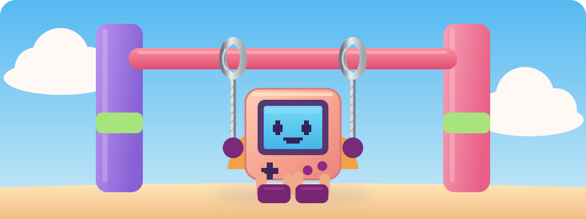
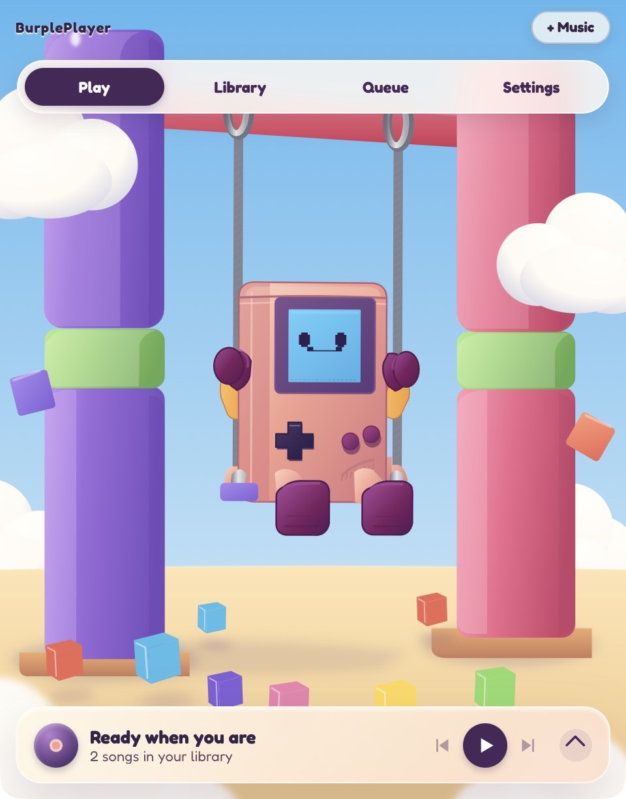
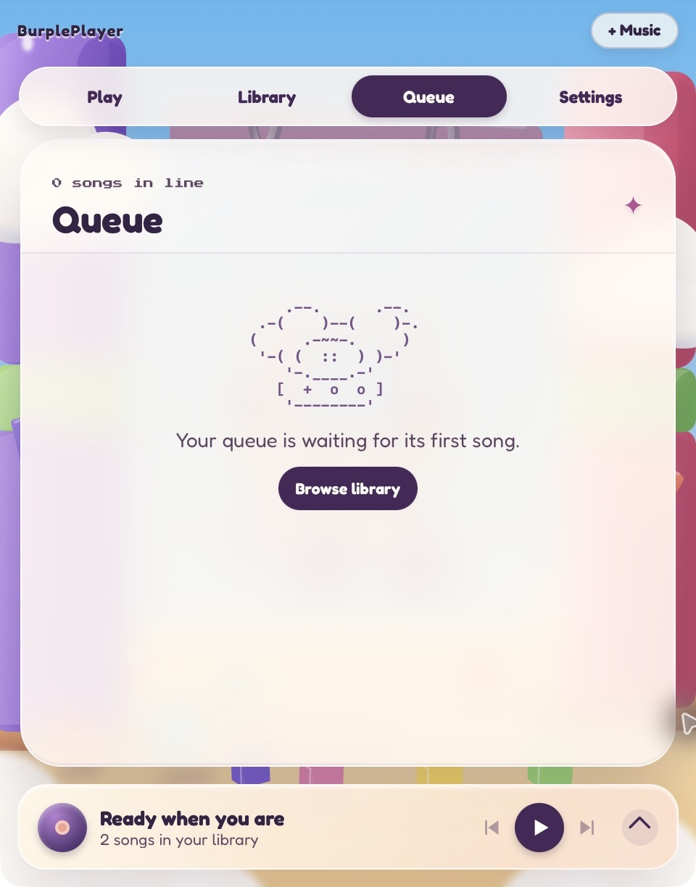

<p align="center">
  
</p>

<h1 align="center">BurplePlayer</h1>

<p align="center">
  A local-first desktop music player inside a pastel, animated clay playground.
</p>

<p align="center">
  <strong>Tauri 2</strong> · <strong>Rust audio</strong> · <strong>React + TypeScript</strong> · <strong>SVG + GSAP</strong>
</p>



The scene is the interface: the pink console swings between two pillars, its LCD shows the current track and spectrum, and the little cubes on the ground represent the next songs in the queue. The visual direction comes from [`design/reference.png`](design/reference.png); the app itself is hand-built SVG and CSS, not a background image.

## Download

Get installers from [GitHub Releases](https://github.com/atulhacks/burpleplayer/releases):

| System                             | Download               |
| ---------------------------------- | ---------------------- |
| macOS Apple Silicon (M1 and newer) | `aarch64.dmg`          |
| macOS Intel                        | `x64.dmg`              |
| Windows x64                        | `_setup.exe` or `.msi` |
| Ubuntu x64                         | `.deb`                 |
| Other x64 Linux distributions      | `.AppImage`            |

The [desktop release workflow](.github/workflows/release.yml) builds each architecture on a native GitHub runner. A pushed `v*` tag creates a draft release and publishes it only when every platform build succeeds; a manual workflow run builds test artifacts without creating a public release. The macOS bundles are ad-hoc signed, not notarized; Windows installers are unsigned.

## What works

| Area          | Features                                                                                                                                   |
| ------------- | ------------------------------------------------------------------------------------------------------------------------------------------ |
| Playback      | Local MP3, FLAC, WAV, Ogg, and AAC decoding; play/pause, seek, volume, previous/next, queue jumping, OS media controls                     |
| Library       | Native folder picker, recursive scans, tags and artwork, album/artist/folder browsing, search, SQLite persistence, playlists and Favorites |
| Scene         | Live LCD face, track text and 16-band spectrum; a ring-anchored pendulum, drifting clouds, reactive queue cubes, day/twilight themes       |
| Views         | Now Playing, Library, Queue, and Settings with an interruptible cloud-wipe transition and tinted glass panels                              |
| Accessibility | Keyboard controls, visible focus, labeled controls, reduced-motion override, static animation fallbacks, contrast audit                    |

The Rust backend owns audio, the queue, and the library. React sends typed Tauri commands and renders backend snapshots and events; it never reads audio files directly.

## Screenshots

macOS release build, with the native titlebar cropped:

| Now Playing                                                                                                      | Queue                                                                                              |
| ---------------------------------------------------------------------------------------------------------------- | -------------------------------------------------------------------------------------------------- |
|  |  |

## Run locally

Install Node.js, pnpm, Rust, and the platform prerequisites for [Tauri 2](https://v2.tauri.app/start/prerequisites/). On macOS, install the Xcode Command Line Tools. Then:

```sh
pnpm install
pnpm tauri dev
```

To build an installable desktop app:

```sh
pnpm tauri build
```

The macOS bundle appears at `src-tauri/target/release/bundle/macos/BurplePlayer.app`; the DMG appears under `src-tauri/target/release/bundle/dmg/`. On the workstation used for this project, the macOS 26.5 SDK can be selected explicitly with `SDKROOT=/Library/Developer/CommandLineTools/SDKs/MacOSX26.5.sdk pnpm tauri build`.

## Controls

| Control           | Action                                                             |
| ----------------- | ------------------------------------------------------------------ |
| D-pad left/right  | Previous/next track                                                |
| D-pad up/down     | Volume up/down                                                     |
| A button or Space | Play/pause; open the music-folder picker when the library is empty |
| B button          | Open Queue                                                         |
| Queue cube        | Jump to that upcoming song                                         |
| Heart in the dock | Add/remove the current track from Favorites                        |
| Tab / Enter       | Move through and activate controls                                 |
| Escape            | Return to Now Playing from a panel                                 |

The dock expands to show seek and volume sliders. Library supports song search, album/artist/folder browsing, playlists, and enqueue actions; Queue supports drag reordering and keyboard move/remove buttons. Settings manages folders, theme, motion, and bar/ASCII visualizer modes.

## Project map

| Path                       | Responsibility                                                                     |
| -------------------------- | ---------------------------------------------------------------------------------- |
| `src/components/scene/`    | Sky, clouds, pillars, rings, ropes, character, cubes, and shared GSAP scene motion |
| `src/components/controls/` | Now Playing transport, seek, volume, and Favorites                                 |
| `src/components/panels/`   | Library, Queue, and Settings glass views                                           |
| `src/components/extras/`   | Authored Lottie-format SVG shapes and ASCII art                                    |
| `src/store/`               | Zustand UI preferences and mirrors of backend playback/library state               |
| `src/lib/`                 | Typed IPC, event handling, album-art palette extraction, opt-in frame probe        |
| `src-tauri/src/audio/`     | Symphonia decoding, Rodio output, queue, spectrum, media controls                  |
| `src-tauri/src/library/`   | Lofty tags/artwork, WalkDir scanning, SQLite library and playlists                 |
| `src-tauri/src/ipc/`       | Tauri commands and event payloads                                                  |

The bundle identifier is `com.burpleplayer.desktop`. On first launch, an existing `com.burpleplayer.app` SQLite library is copied into the new app-data location without changing the old database. [`src-tauri/src/README.md`](src-tauri/src/README.md) documents the command and event contract.

## Motion and accessibility

The main scene uses a single GSAP ticker. Both ropes pivot from fixed SVG rings while the console follows their arc with a small counter-tilt; spectrum energy and volume influence the swing, and bass/kicks lift the queue cubes. Two cloud layers drift independently; the foreground blur stays still to avoid repainting a large filtered region. The LCD spectrum updates SVG bar transforms through refs at roughly 30 Hz without a React rerender per event.

The heart burst, import-success cubes, empty-library console, and scanning cloud are original Lottie-format JSON shapes in `src/assets/lottie/`, generated by `scripts/generate-lottie.mjs` and rendered with the shared ticker. ASCII mode provides a 20-column LCD spectrum and scanning/empty art. The swing preview above is a self-contained animated SVG with a still state under `prefers-reduced-motion`.

Scene motion stops when the window is hidden, a glass panel is open, or reduced motion is selected. The LCD remains live in reduced mode. Keyboard and contrast findings are recorded in [`docs/accessibility-performance-audit.md`](docs/accessibility-performance-audit.md).

## Checks and current performance result

```sh
pnpm typecheck
pnpm lint
pnpm format:check
pnpm audit:contrast
pnpm build
cargo test --manifest-path src-tauri/Cargo.toml
```

The current audit measured an opt-in **release** build on an Apple M4 with a 60 Hz display. Both GSAP and raw `requestAnimationFrame` ran at about **30 Hz**, including while the scene was visually hidden; one transition reached roughly 130 ms. The requested steady 60 fps / zero-dropped-transition-frame target is therefore **not met in that measured run**. The evidence, limits of the measurement, and reproduction steps are in the [audit report](docs/accessibility-performance-audit.md). The regular app build does not contain the extra audit rAF loop.

## Fonts and design assets

[Fredoka](https://github.com/google/fonts/tree/main/ofl/fredoka) and [Press Start 2P](https://github.com/google/fonts/tree/main/ofl/pressstart2p) are bundled locally under `src/assets/fonts/` with their SIL Open Font License files. The app icon is in `src-tauri/icons/`, and the README swing illustration is [`docs/swing-preview.svg`](docs/swing-preview.svg).

## Skill application

The requested skill set is reflected in the shipped code: `svg-animation` in the scalable character, anchored rope/ring motion, LCD, and README preview; `gsap-web` in the shared scene ticker and view timeline; `micro-interaction` in console and dock press/slider feedback; `page-transition-animation` in the cloud wipe; `glassmorphism` in the static tinted panels; `lottie-animation` in the authored JSON shape effects; `ascii-animation` in LCD and scanning art; and `accessible-animation` plus `60fps-animation` in reduced-motion, focus, contrast, and performance audit work.
